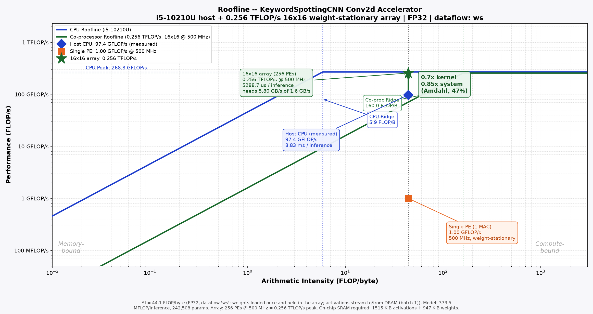

# Roofline Analysis -- Keyword Spotting CNN

**Model:** `KeywordSpottingCNN` (242,508 params, 12 classes)  
**Input:** `[1, 1, 40, 101]` (batch, channel, n_mels, time frames)  
**Precision:** FP32 (4 byte/element)  
**Dataflow:** `ws` -- weights loaded once and held in the array; activations stream to/from DRAM (batch 1)



## Platforms

> Peak numbers are **hypotheses** except where marked measured. Override with `--cpu-gflops`, `--cpu-bw`, `--array`, `--freq-mhz`, `--chiplet-bw`.

| Platform | Peak | Bandwidth | Ridge point |
| -------- | ---- | --------- | ----------- |
| i5-10210U (host) | 268.8 GFLOP/s | 45.8 GB/s | 5.9 FLOP/byte |
| Chiplet 16x16 @ 500 MHz | 256.0 GFLOP/s (0.256 TFLOP/s) | 1.6 GB/s | 160.0 FLOP/byte |

## Workload

| Quantity | Value |
| -------- | ----- |
| MACs per inference | 186,770,892 |
| FLOPs per inference | 373,541,784 (373.5 MFLOP) |
| DRAM bytes per batch | 8,461,952 |
| **Arithmetic intensity** | **44.14 FLOP/byte** |
| Bound on chiplet | **memory-bound** (AI 44.1 vs ridge 160.0) |
| Attainable on chiplet | 70.6 GFLOP/s |
| Latency per inference | 5288.7 us |

## Interface Bandwidth

```
Required BW = chiplet peak / arithmetic intensity
            = 256.0 GFLOP/s / 44.14 FLOP/byte
            = 5.80 GB/s
```

Provided: 1.6 GB/s (0.28x margin).

## On-Chip SRAM Required

| Buffer | Size |
| ------ | ---- |
| Weights (all layers, resident) | 947.3 KiB |
| Activations (largest live pair) | 1515.0 KiB |
| **Total** | **2462.3 KiB** |

## Speedup

| Quantity | Value |
| -------- | ----- |
| Host CPU achieved (measured, batch 1) | 97.4 GFLOP/s (3.83 ms/inference) |
| Chiplet attainable | 70.6 GFLOP/s |
| Kernel speedup | 0.7x |
| Accelerated fraction (Amdahl) | 47% |
| **System speedup** | **0.85x** |

```
Speedup_system = 1 / ((1 - 0.470) + 0.470 / 0.7)
               = 0.85x
```

## Dataflow Comparison

Same model, same precision -- only the DRAM traffic model changes:

| Dataflow | DRAM bytes | AI (FLOP/byte) |
| -------- | ---------- | -------------- |
| `none` | 8,461,952 | 44.14 |
| `ws` | 8,461,952 | 44.14 |
| `fused` | 986,240 | 378.75 |

Weight-stationary alone moves the needle very little at batch 1: the weights
are only 947 KiB of the traffic, while the activations are the bulk.
The large gain comes from keeping activations on-chip between layers (`fused`).

## Precision Note

Operation count is fixed by the architecture, so AI scales inversely with bytes
per element: FP32 -> INT8 divides DRAM traffic by 4 and multiplies AI by 4.
Re-run with `--bytes-per-elem 1` for the INT8 roofline.
