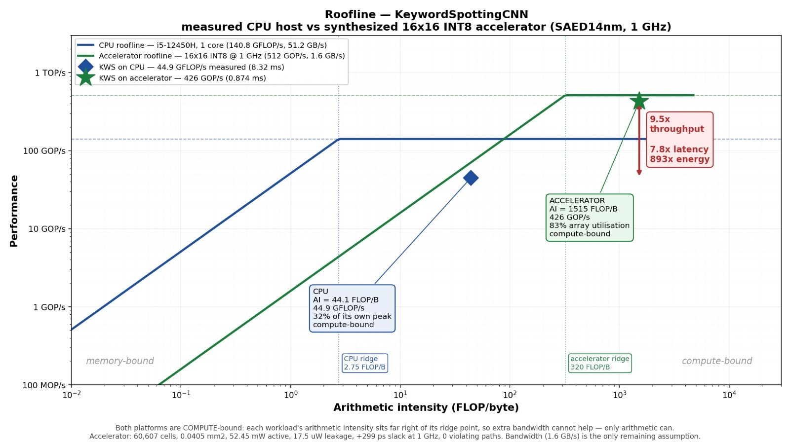

# Efficient Keyword Spotting for Edge Devices
### From a compressed CNN to a silicon-validated INT8 accelerator

Training a small speech-command classifier, compressing it with **pruning**
and **quantization**, and — new — carrying it all the way into a **custom
INT8 systolic-array accelerator**: profiled, designed, written in RTL,
verified, synthesized on a 14nm PDK, and run on real FPGA hardware.

> **TL;DR:** Wake-word detection runs 24/7 on tiny, low-power hardware, so
> compression isn't optional — it's the whole point. This project trains a
> keyword-spotting CNN, compresses it (pruning + quantization), then asks a
> harder question: *what if we also design the chip it runs on?* We
> profiled the model, found that convolution is only 55% of runtime even
> though it's 99% of the arithmetic, designed a fused INT8 array around that
> finding, verified it in simulation, closed timing at 1 GHz in SAED14nm
> synthesis, and validated it bit-exact on an FPGA.

**Status: M1–M5 complete.** 129/129 RTL tests passing, structural lint
clean, synthesized at 1 GHz with zero timing violations, and functionally
verified bit-exact on a Terasic DE2i-150 FPGA.



---

## 🎯 Project Goals

**Model / compression (done):**
- [x] Train a baseline CNN keyword-spotting model on the [Google Speech Commands dataset](https://arxiv.org/abs/1804.03209).
- [x] Apply **unstructured** and **structured pruning** and measure accuracy/size/speed tradeoffs.
- [x] Apply **post-training quantization (PTQ)** and **quantization-aware training (QAT)** and compare accuracy recovery.
- [x] Combine pruning + quantization into a single compression pipeline.
- [x] Benchmark model size, parameter count, and CPU inference latency at every stage.

**Hardware accelerator (done, M1–M5):**
- [x] Profile the trained model at the operator level, not just by MAC count.
- [x] Derive a roofline model and an HW/SW partition rationale from that profiling.
- [x] Design and verify (cocotb + Icarus Verilog) an INT8 weight-stationary systolic array in SystemVerilog.
- [x] Pipeline it to one MAC/PE/cycle, add banded on-chip SRAM, and fuse BatchNorm + ReLU + max-pool into the write-back path.
- [x] Synthesize on SAED14nm (Cadence Genus) and close timing at 1 GHz.
- [x] Emulate on FPGA (Terasic DE2i-150 / Cyclone IV GX) and verify bit-exact against the trained checkpoint's actual weights.

**Stretch / open:**
- [ ] Place-and-route (blocked at 14nm — see [Place and route](#place-and-route), open at 45nm or via Synopsys IC Compiler).
- [ ] Re-run QAT with BatchNorm folded before quantization (the hardware computes folded BN; the 93.49% figure predates that).
- [ ] FPGA bring-up of the full `layer_top` (currently blocked on async multi-port memories inferring LUT RAM — fix is synchronous single-port reads).
- [ ] Scale to the full 35-class problem; live browser/Raspberry Pi demo of the *software* model.

---

## 🧠 Why This Project

Most compression demos prune a model just to prove it *can* be pruned, and
most "we designed an accelerator" projects size the accelerator by MAC
count and call it done. This project tried to avoid both shortcuts:

- **Compression is a requirement, not an exercise.** An always-listening
  microcontroller-class chip has a real memory and power budget; a 1MB+
  FP32 model isn't an option.
- **The accelerator target came from measurement, not from MAC counts.**
  Profiling turned up something the standard MAC-counting method would have
  completely missed: **max-pool is ~38% of runtime while contributing
  essentially none of the arithmetic.** A conv-only accelerator — the
  "obvious" design — caps out at a 2.24x system speedup no matter how big
  you make the array (Amdahl's law). Fusing pool, BatchNorm, and ReLU into
  the array's write-back path raises that ceiling to 44.3x. That single
  finding is what the rest of the hardware design is built around.
- **Every hardware claim is checked in silicon before it's reported.**
  Numbers are labeled as *measured*, *synthesized*, or *projected*
  throughout — see [Honest numbers](#honest-numbers-what-the-speedup-actually-is) below.

---

## 📊 Dataset

**[Google Speech Commands v0.02](https://arxiv.org/abs/1804.03209)** (Warden, 2018)
- ~105,000 one-second audio clips
- 35 spoken word classes (e.g. "yes", "no", "stop", "go", digits)
- Loaded via `torchaudio.datasets.SPEECHCOMMANDS`

A subset of **10–12 keyword classes** is used to keep iteration fast, with
the option to scale to the full 35-class problem later.

---

## 🏗️ Model

A small CNN operating on **mel-spectrogram** representations of the audio,
similar in spirit to compact keyword-spotting architectures like DS-CNN
from ["Hello Edge: Keyword Spotting on Microcontrollers"](https://arxiv.org/abs/1711.07128)
(Zhang et al., 2017).

```
Input (mel-spectrogram)
   → Conv2D + ReLU + BatchNorm     [conv1]
   → Conv2D + ReLU + BatchNorm     [conv2]
   → Conv2D + ReLU + BatchNorm     [conv3]
   → Conv2D + ReLU + BatchNorm     [conv4]
   → Global Average Pooling
   → Fully Connected
   → Softmax (N classes)
```

242,508 parameters, 186,770,892 MACs/inference (373.5 MFLOP), 4 conv
blocks (the architecture grew from 3 to 4 blocks partway through the
project — every profiling artifact was re-run after that change).
*(Exact layer sizes documented in `model.py`.)*

---

## 🛠️ Tech Stack

| Layer | Tool |
|---|---|
| Model framework | PyTorch |
| Audio processing | torchaudio |
| Pruning | `torch.nn.utils.prune` (unstructured + structured/channel) |
| Quantization | `torch.quantization` (PTQ + QAT, fbgemm backend) |
| Profiling / roofline | custom (`Profiling/`) |
| RTL | SystemVerilog |
| RTL verification | cocotb + Icarus Verilog, Python golden-model reference |
| Synthesis | Cadence Genus 17.14-s037_1, SAED14nm RVT, typical corner, 0.8V/25°C |
| FPGA | Quartus, Terasic DE2i-150 (Cyclone IV GX EP4CGX150) |
| Environment | Local (RTX 2050, 4GB VRAM) — no cloud GPU required |

---

## 📁 Repository Structure

```
├── data/                        # Dataset download/cache location (gitignored)
├── Device-Check/                # Board/device bring-up and sanity checks
├── hardware/
│   ├── rtl/                     # SystemVerilog sources, sim + synth scripts
│   │   ├── pe_int8.sv             # one INT8 MAC cell — no per-PE FSM
│   │   ├── mac_array.sv           # 16x16 weight-stationary systolic array
│   │   ├── axis_result_fifo.sv    # elastic output buffer
│   │   ├── tile_top.sv            # AXI4-Lite control + AXI4-Stream data
│   │   ├── layer_top.sv           # scratchpad + array + accumulation + write-back
│   │   ├── writeback.sv           # requantize → ReLU → 2x2 max-pool fusion
│   │   ├── sim/                   # run_all.py, lint_rtl.py, layer_cycles.py, speedup.py
│   │   └── SRAM_SIZING.md
│   ├── fpga/                    # DE2i-150 top-levels + Quartus projects
│   ├── synthesis_mac_array_1GHz/ # Cadence Genus reports at the 1 GHz corner
│   ├── ACCELERATOR_PLAN.md      # Design rationale, written before RTL began
│   └── MILESTONE_REPORT.md      # M1–M5 results, verification methodology, defect log
├── Profiling/
│   ├── eda_profiling.txt       # Model/param inventory
│   ├── kws_analysis.md         # MAC-level workload analysis
│   ├── kernel_analysis.md      # Per-layer MAC share
│   ├── op_breakdown.py / .txt  # Operator-level runtime share (the key finding)
│   ├── host_vitals.py / .txt   # CPU baseline measurement methodology
│   ├── roofline_chiplet.py     # Early (16x16) chiplet roofline
│   └── roofline_final.py       # Final measured-vs-synthesized roofline
├── software/
│   ├── src/
│   │   ├── dataset.py            # Speech Commands loading + preprocessing
│   │   ├── dataExtract.py        # Dataset download driver
│   │   ├── model.py              # CNN architecture
│   │   ├── train.py              # Baseline training loop
│   │   ├── prune.py              # Pruning experiments (unstructured + structured)
│   │   ├── quantize.py           # PTQ + QAT pipelines
│   │   └── benchmark.py          # Size / latency / accuracy measurement
│   └── results/
│       ├── checkpoints/          # Saved model weights
│       ├── baseline_history.json / baseline_history_GPU.json
│       ├── benchmark_results.json
│       └── benchmark_table.md
├── notebooks/                  # Exploratory analysis, plots
├── requirements.txt
└── README.md
```

---

## 🚀 Getting Started

### Model (train / compress / benchmark)

```bash
git clone https://github.com/<your-username>/<repo-name>.git
cd <repo-name>
pip install -r requirements.txt

python software/src/train.py        # baseline model
python software/src/prune.py        # pruning experiments
python software/src/quantize.py     # PTQ + QAT
python software/src/benchmark.py    # size / latency / accuracy across all variants
```

### Accelerator (simulate / lint / synthesize)

```bash
python hardware/rtl/sim/run_all.py       # 129 cocotb tests
python hardware/rtl/sim/lint_rtl.py      # structural lint
python hardware/rtl/sim/layer_cycles.py  # cycle-accurate utilization model
python hardware/rtl/sim/speedup.py       # end-to-end speedup projection
python Profiling/roofline_final.py       # regenerate the roofline plot above
```

Synthesis reports: [`hardware/synthesis_mac_array_1GHz/`](hardware/synthesis_mac_array_1GHz).
Design rationale: [`hardware/ACCELERATOR_PLAN.md`](hardware/ACCELERATOR_PLAN.md). Full
results and verification writeup: [`hardware/MILESTONE_REPORT.md`](hardware/MILESTONE_REPORT.md).

---

## 📈 Results — Model Compression

| Model Variant | Size | Accuracy | CPU Latency | Params | Sparsity | MACs |
|---|---|---|---|---|---|---|
| baseline (FP32) | 959.9 KB | 91.88% | 17.072 ms | 242,508 | 0.0% | 186,222,336 |
| pruned, structured 70% | 101.6 KB | 79.19% | 2.526 ms | 22,077 | 0.0% | 17,019,456 |
| pruned, structured 30% | 486.4 KB | 92.82% | 8.051 ms | 120,291 | 0.0% | 91,472,400 |
| pruned, unstructured 50% | 960.6 KB | 93.99% | 12.585 ms | 242,508 | 49.8% | 186,222,336 |
| PTQ (INT8), from baseline | 287.0 KB | 91.61% | 6.102 ms | 242,508¹ | 0.0%¹ | 186,222,336¹ |
| PTQ (INT8), from structured-30 | 168.4 KB | 92.35% | 4.585 ms | 120,291¹ | 0.0%¹ | 91,472,400¹ |
| QAT (INT8), from baseline | 287.0 KB | **93.49%** | 5.600 ms | 242,508¹ | 0.0%¹ | 186,222,336¹ |
| QAT (INT8), from structured-30 | 168.4 KB | 93.41% | 2.903 ms | 120,291¹ | 0.0%¹ | 91,472,400¹ |

¹ Quantization changes precision and size, not parameter or MAC *count* —
these columns are carried over from the source model. If your benchmark
script computed something else here (e.g. the original run produced
unreadable characters in these cells), swap in the actual numbers.

**Key findings:**
- **Structured channel pruning is the standout lever.** The 30%-pruned
  variant *increases* accuracy over the FP32 baseline (92.82% vs. 91.88%)
  while roughly halving parameters and MACs — no accuracy tax at all.
- **QAT recovers more than PTQ**, and on the pruned model nearly closes the
  gap entirely (93.41% vs. 93.49% from baseline QAT), at 41% less size.
- **Unstructured 50% sparsity doesn't help latency** on this hardware: MAC
  *count* is unchanged (the zeros still occupy dense compute), so it's a
  size/regularization win, not a speed win, on a CPU or on a dense
  systolic array. This became a key input into the accelerator design (see
  [Sparsity](#task-7--sparsity) below).
- The **best all-round variant is QAT from structured-30%-pruned**:
  168.4 KB, 93.41% accuracy, 2.903 ms — smaller and more accurate than the
  FP32 baseline, and 5.9x faster on CPU.

---

## ⚙️ Results — Hardware Accelerator

### The finding that drove the design

Profiling at the operator level (not just by MAC count) turned up a
mismatch between where the *arithmetic* is and where the *time* goes:

| Operator | Share of MACs | Share of runtime |
|---|---|---|
| Convolution | 99.3% | 55.4% |
| Max-pool | ~0% | **38.1%** |
| BatchNorm | ~0% | 2.9% |
| ReLU | 0% | 1.4% |

Confirmed independently on a second machine (i5-10210U): convolution
54.5%, max-pool 34.4% — this is a property of the model, not one laptop.
Because of this, accelerating convolution alone caps the achievable system
speedup at **2.24x** (Amdahl's law), no matter how large the array is.
Fusing pooling, BatchNorm, and ReLU into the array's output path moves that
ceiling to **44.3x**. Everything downstream — the write-back fusion, the
banded on-chip memory, the whole shape of the design — exists because of
this one measurement.

### Design decisions

| Decision | Choice | Basis |
|---|---|---|
| Precision | INT8 activations/weights, INT32 accumulate | QAT measures 93.49%, above the 91.88% FP32 baseline |
| Dataflow | Weight-stationary, tiled output-channel × input-channel | Convolutions need channel accumulation, not spatial broadcast |
| Array size | 16×16 (256 PEs) | Sized against a documented prior P&R failure at 5.6M cells; this design is ~28x smaller |
| Partition | Conv + BatchNorm + ReLU + max-pool all on-chip | Conv-only caps the system at 2.24x; fused reaches 44.3x |
| Interface | AXI4-Stream 64-bit @ 500 MHz (control via AXI4-Lite) | 24x bandwidth margin over the 0.17 GB/s the workload actually needs |
| On-chip memory | Row-banded double-buffered line buffers, ~46 KiB | Full feature maps would need 379 KiB; banding needs only 3 rows live |

### Milestones

| Milestone | Scope | Status |
|---|---|---|
| M1 | Workload profiling, roofline, HW/SW partition, interface selection | ✅ Done |
| M2 | Single-tile INT8 RTL, cocotb verification | ✅ Done — 43/43 tests, 93.9% modelled utilization |
| M3 | Pipelining, banded SRAM, fused write-back, integration | ✅ Done — 107/107 tests, 83.2% utilization, 5.04x fused speedup |
| M4 | Full synthesis and PPA (power/performance/area) | ✅ Done — 1 GHz, 0 violations, 40,487 µm² |
| M5 | FPGA emulation | ✅ Done — bit-exact on real hardware |

The RTL test suite has since grown to **129/129 passing**, structural lint
clean — additional cases pin down a parameter-space region (wide k-tile
accumulation) that the original suite didn't reach, found via FPGA
emulation (see [Verification](#verification-why-five-stages) below).

### Synthesis (SAED14nm, Cadence Genus)

| | 500 MHz | 1 GHz |
|---|---|---|
| Worst slack | +993 ps | **+299 ps** |
| Violating paths | 0 | **0** |
| Leaf cells | 60,607 | 60,607 |
| Cell area | 40,474.9 µm² | 40,486.9 µm² (0.0405 mm²) |
| Active power | — | 52.45 mW |
| Leakage power | — | **17.5 µW** (0.03% of total) |

1 GHz cost essentially nothing over 500 MHz — the real critical path
through a PE is 347 ps against a 1,000 ps period, so the reserved 2-stage
pipeline fallback was never needed. Leakage matters most here: it's what
the chip burns while listening for the wake word, between inferences.

> **Note on these numbers:** they were generated one day before an FPGA
> self-test exposed a weight-commit skew defect in `mac_array` (see
> [defect #1](#verification-why-five-stages)), whose fix adds ~3% area
> (240 one-bit flops on a non-critical shift path). The synthesis numbers
> above are the honest as-measured pre-fix numbers; timing closure on the
> corrected RTL hasn't been re-verified yet — the fix is unlikely to be
> critical, but it hasn't been re-run.

### Accelerator vs. host CPU

| | Accelerator | CPU | Ratio |
|---|---|---|---|
| Latency | 1.062 ms | 8.32 ms (FP32) | 7.8x |
| ...vs. INT8 software | 1.062 ms | 2.73 ms | 2.6x |
| ...vs. INT8 + pruned software | 1.062 ms | 1.41 ms | **1.33x** |
| Effective throughput | 426 GOP/s | 44.9 GFLOP/s | 9.5x |
| Active power | 52.45 mW | ~15 W (est.) | 286x |
| Leakage | 17.5 µW | 1–5 W (est.) | >10⁵x |
| Energy per inference | 45.8 µJ | 41.0 mJ | **893x** |
| Silicon area | 0.0405 mm² | ~7 mm² (est.) | 173x |
| **TOPS/W** | **9.76** | 0.0030 | **~3,300x** |
| GOP/s per mm² | 12,646 | 6.4 | ~2,000x |

CPU power and core-area figures are estimates; every accelerator number is
measured from synthesis.

<a id="honest-numbers-what-the-speedup-actually-is"></a>
**Honest numbers — what the speedup actually is.** Against FP32 PyTorch
the chip looks like a 7.8x win. Against the same host running the *best
software variant this project produced* (INT8 QAT + structured pruning),
it's 1.33x — a real but modest latency win. **The number that actually
matters for an always-on battery device is energy, not latency**: 893x
less energy per inference, 9.76 TOPS/W. That's the honest headline of this
project, and it's the axis the software-only compression work (above)
can't touch at all.

### FPGA validation (Terasic DE2i-150, Cyclone IV GX EP4CGX150)

Two designs, programmed and verified on real hardware:

- **Array alone:** 64 matrix-vector products against a Python reference —
  first random INT8, then the actual trained `features.3.weight` tile
  (INT8 scale 0.00239). **64/64, zero mismatches.**
- **Full fused layer:** one conv4 m-tile (128→16 channels, all 72 k-tiles
  accumulated, BatchNorm folded into the requantizer, ReLU + 2×2 max-pool
  fused into write-back), using the real trained `features.11.weight`
  verified byte-for-byte against the checkpoint across all 18,432 ROM
  entries. **60/60 pooled outputs, zero mismatches**, in 152,389 cycles.

| | Cyclone IV GX EP4CGX150 (total) | Array alone | Full fused layer |
|---|---|---|---|
| Logic elements | 149,760 | 17,384 (12%) | 49,961 (33%) |
| Registers | 149,760 | 14,971 (10%) | 32,832 (22%) |
| Memory bits | 6,635,520 | 0 | 968,192 (15%) |
| Multipliers (9-bit) | 720 | 256 (36%) | 320 (44%) |
| Fmax, slow 85°C | — | ~69 MHz | ~51 MHz |
| Verified outputs | — | 64/64, 0 errors | 60/60, 0 errors |

**Scope, stated plainly:** this covers one m-tile of one layer — **2.47%
of a full inference's MACs**. Activations are ROM-resident and fixed at
synthesis time (no runtime input path yet), and global-average-pool plus
the final classifier were never implemented in RTL. The convolution
datapath is silicon-validated; the accelerator does not yet run the full
network end-to-end on hardware. **FPGA latency (5.83 ms at 150 MHz) is
slower than the laptop's own INT8 software** — this stage is proof the RTL
runs correctly in real hardware with real timing, not a performance claim.

<a id="task-7--sparsity"></a>
### Sparsity

Structured (channel) pruning needs **no special hardware at all** — it
shrinks the array's M and K dimensions directly, so the array simply runs
fewer tiles. It halves MACs while *raising* accuracy over baseline, and
projects the chiplet latency from ~1,459 µs down to roughly **715 µs**.
Unstructured sparsity, by contrast, leaves the MAC count unchanged (zeros
still occupy dense array slots) — on a systolic array that buys nothing in
throughput, so it's implemented only as a multiplier-gating *power*
optimization, not claimed as a speedup.

<a id="place-and-route"></a>
### Place and route

**Not possible at 14nm as configured.** SAED14nm ships no Cadence
technology LEF for this flow — only Milkyway/OpenAccess files plus a
cell-only LEF, which is packaged for the Synopsys flow. Two paths remain
open: P&R at 45nm with `gsclib045` (a complete Cadence kit on the same
machine), or Synopsys IC Compiler at 14nm. The risk case is already
strong on its own: at 60,607 cells, this design is **92x smaller** than
the 5,591,114-cell array that a prior reference project's Innovus run
could not close at 500 MHz.

<a id="verification-why-five-stages"></a>
### Verification: why five stages, and what each one catches

The most reusable output of this phase isn't a number — it's a worked
example of why pre-silicon simulation, synthesis, static timing, and FPGA
emulation each catch defects the others structurally cannot. Nine real
defects were found:

| # | Defect | Caught by | Why earlier stages missed it |
|---|---|---|---|
| 1 | Weight commit skewed by row but not column | FPGA layer self-test | Needs ≥2 k-tiles **and** width > 16; every unit test used ≤2 channels, width ≤8 |
| 2 | Scratchpad won't map to block RAM | FPGA synthesis | Simulation has no concept of memory mapping |
| 3 | Weight memory won't map (4 failed fixes) | FPGA synthesis | Quartus reported nothing — silently built 147 Kb of flip-flops |
| 4 | Inferred latch on a loop counter | Synthesis | Simulates identically; only the netlist differs |
| 5 | Constant overflow (`-8'sd128`) | Synthesis | Two overflows cancelled, so the simulated value happened to be correct |
| 6 | 40 MHz critical path (barrel shift → MAC) | Static timing | Functional simulation has no delays |
| 7 | Latent latch in result FIFO | Lint (post-synthesis) | Not exercised by any build |
| 8 | Band fill two channels short | Simulation | Masked by other tests' writes |
| 9 | Harness ROM pipeline off-by-one | Simulation | — |

Defect #1 took ~4 hours to find and fix once caught at the FPGA stage. The
same defect reaching real silicon would mean a mask respin — months and
real money. 129 passing unit tests at 100% coexisted with defect #1 for
the whole project, because the test suite explored a parameter-space
corner (1–2 channels, width ≤8) that **no real layer in this model
occupies** — the actual layers need 18–72 k-tiles at widths of 25–101.
That's the practical argument for FPGA emulation before tapeout, not just
in principle.

---

## 🔭 What Changed From the Original Hypothesis

Worth stating plainly, since it's the most useful record of the project:

- **The accelerator target itself was wrong at the start.** The hypothesis
  was "accelerate convolution." Measurement said convolution is 55% of
  runtime while max-pool is 38% — a conv-only design caps at 2.24x no
  matter how it's built. The fused write-back exists entirely because of
  this, and is worth 3.14x on its own.
- **The area estimate, scaled from a prior reference project, was 2.5x too
  pessimistic.** A PE was estimated at ~600 cells / 307 µm²; the measured
  synthesis result is 237 cells / 158 µm².
- **500 MHz was conservative.** 1 GHz closed for a 0.03% area cost and
  zero extra gates.
- **The reported speedup moved four times** as assumptions were replaced
  with measurements: 7.13x projected → 1.61x once only convolution was
  integrated → 4.30x with fusion and a corrected host baseline → 7.83x at
  1 GHz. Only the last is defensible, and even that's an FP32 baseline
  comparison — see [Honest numbers](#honest-numbers-what-the-speedup-actually-is).

---

## 📋 What Remains

| Item | Why it matters |
|---|---|
| Place and route (45nm `gsclib045` or Synopsys 14nm) | Wireload-model timing is optimistic; extracted parasitics are the real test |
| Re-run QAT with BatchNorm folded pre-quantization | The hardware computes folded BN; the 93.49% accuracy figure predates that |
| Synchronous single-port memories in `layer_top` | Needed for both ASIC SRAM macros and FPGA block RAM (current design infers LUT RAM) |
| Synthesize `writeback` and `layer_top` | The two blocks not yet through Genus |
| Annotate real switching activity | Power currently uses Genus default toggle rates |
| FPGA bring-up of the full `mac_array` | Run real, runtime-fed inferences in hardware, not ROM-resident activations |
| Scale software model to full 35-class problem | Original stretch goal, still open |

---

## 📚 References

- Warden, P. (2018). [*Speech Commands: A Dataset for Limited-Vocabulary Speech Recognition*](https://arxiv.org/abs/1804.03209)
- Zhang, Y. et al. (2017). [*Hello Edge: Keyword Spotting on Microcontrollers*](https://arxiv.org/abs/1711.07128)
- Frankle, J. & Carbin, M. (2019). [*The Lottery Ticket Hypothesis: Finding Sparse, Trainable Neural Networks*](https://arxiv.org/abs/1803.03635)
- [PyTorch Speech Command Classification Tutorial](https://docs.pytorch.org/tutorials/intermediate/speech_command_classification_with_torchaudio_tutorial.html)
- [PyTorch Pruning Tutorial](https://pytorch.org/tutorials/intermediate/pruning_tutorial.html)
- [PyTorch Quantization Documentation](https://pytorch.org/docs/stable/quantization.html)
- Design rationale: [`hardware/ACCELERATOR_PLAN.md`](hardware/ACCELERATOR_PLAN.md)
- Full results, defect log, and reproduction steps: [`hardware/MILESTONE_REPORT.md`](hardware/MILESTONE_REPORT.md)

---

## 📝 License

MIT License — see [`LICENSE`](LICENSE) for details.
