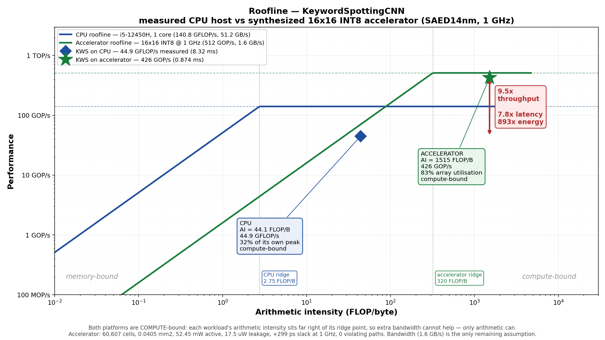

# KWS INT8 Accelerator — Hypothesis and Milestones M1–M4

HW/SW co-design of an inference accelerator for `KeywordSpottingCNN`, taken
from workload profiling through RTL to synthesized silicon on SAED14nm.

**Status:** M1–M5 complete. 129/129 tests passing, structural lint clean,
synthesized at 1 GHz with zero violating paths. M5 (FPGA emulation) done:
the array and a full fused layer both verified bit-exact on a DE2i-150.



---

## 0. Initial hypothesis

> A keyword-spotting CNN spends almost all of its arithmetic in 3x3
> convolution. An INT8 weight-stationary systolic array, sized for an
> always-on edge device, should therefore accelerate the workload
> substantially over a general-purpose CPU, at a small fraction of the area
> and power.

What we committed to at the start, and what each commitment rested on:

| Decision | Basis at the time |
| --- | --- |
| INT8 with a wide accumulator | measured: QAT reached 93.49%, above the 91.88% FP32 baseline |
| Weight-stationary systolic array | standard for dense convolution |
| 16x16, 500 MHz | **assumed**, scaled from the ECE 410/510 anemia accelerator |
| ~0.10 mm², 30–60 mW | **assumed**, scaled per-cell from that project's synthesis |
| Accelerate convolution | **assumed** to be where the time goes |

Three of those five were assumptions inherited from another project. The work
below replaced all of them with measurements, and two turned out to be wrong in
ways that changed the design.

---

## M1 — Workload profiling and roofline

**Goal:** find out where the time actually goes, rather than where the
arithmetic is.

The model had been rewritten from 3 conv blocks to 4 partway through, so every
prior profiling artifact was stale. Re-profiling gave:

| Quantity | Value |
| --- | --- |
| Parameters | 242,508 |
| MACs per inference | 186,770,892 |
| Convolution share of MACs | **99.3%** |
| Host baseline | **8.32 ms** (i5-12450H, batch 1, 1 thread, median of 800) |
| Host achieved throughput | 44.9 GFLOP/s = 32% of one core's peak |
| Arithmetic intensity | 1,515 FLOP/byte vs a 2.75 ridge → compute-bound |

### The finding that redirected the project

Operator-level timing disagreed sharply with the MAC counts:

| Operator | Share of MACs | Share of runtime |
| --- | --- | --- |
| Convolution | 99.3% | **55.4%** |
| Max-pool | ~0% | **38.1%** |
| BatchNorm | ~0% | 2.9% |
| ReLU | 0% | 1.4% |

**Max-pool is 38% of runtime while contributing essentially none of the
arithmetic.** It is pure data movement. Confirmed independently on a second
machine (i5-10210U, Comet Lake): convolution 54.5%, max-pool 34.4%. Two
different microarchitectures agree, so this is a property of the model, not of
one laptop.

The consequence is an Amdahl bound. Accelerating convolution alone caps the
system at **2.24x** no matter how large the array. Accelerating convolution,
pooling, BatchNorm and ReLU together raises the ceiling to **44.3x**.

Choosing an accelerator target by MAC count — the standard method, and what the
reference project did — would have produced a design capped at 2.24x.

**Deliverables:** `Profiling/op_breakdown.py`, `host_vitals.py`,
`kernel_analysis.md`, `roofline_final.py`.

---

## M2 — Single-tile RTL and verification

**Goal:** a correct INT8 MAC array with an AXI interface.

| Module | Role |
| --- | --- |
| `pe_int8.sv` | one INT8 multiply into a wide accumulator, registered, **no per-PE FSM** |
| `mac_array.sv` | K x M weight-stationary systolic array |
| `axis_result_fifo.sv` | elastic buffer, since the array cannot stall |
| `tile_top.sv` | AXI4-Lite control, AXI4-Stream data |

### Two decisions that diverge from the reference design

**Channel tiling, not spatial tiling.** The reference accelerator broadcast one
3x3 kernel across 1024 spatial tiles, which only works for single-channel
convolution. Every convolution here is multi-channel (32→64, 64→128, 128→128)
and needs accumulation across input channels, which that structure has no path
for. Tiling over output channel x input channel puts the reduction on the
array's vertical partial-sum chain. conv2, conv3 and conv4 — 99.3% of all MACs
— then tile a 16x16 array exactly.

**No per-PE state machine.** The reference PE ran a 4-state FSM and spent 2 of
every 4 cycles in LOAD and DONE, giving 50% utilization. Ours sustains one MAC
per PE per cycle.

### The systolic skew

A value hops one column per cycle but one row per `PIPE` cycles, so activation
`X[k]` reaches `PE(k,m)` at cycle `n+k+m` while a partial sum started at row 0
reaches row k at `start + PIPE*k`. These coincide for every k only if row k is
injected `PIPE*k` cycles late. The array therefore carries input skew, weight
commit skew, and output deskew internally, keeping the external interface
aligned.

**Result:** 43/43 tests passing, all against an independently written Python
model. Modelled array utilization 93.9%.

---

## M3 — Pipelining, banded memory, fusion, integration

**Goal:** build the thing M1 said was worth building.

### Pipelining

`PIPE` selects psum pipeline depth, with the skew following it. Each PE gained a
**shadow weight register**, so the next tile loads while the current one
streams. The commit is skewed down the array at the speed of the data, so
diagonals in flight finish with the old tile's weights.

One real hazard found and fixed in hardware: because the commit is skewed, the
shadows must stay untouched for K cycles after a commit. Starting the next shift
immediately corrupted every row below the first, producing an array holding
*neither* tile — plausible-looking numbers that nothing downstream would flag.

### Banded scratchpad

Holding whole feature maps needs the largest live pair, 387,840 B = 378.8 KiB.
A 3x3 convolution only needs three input rows live at once:

| Buffer | Bytes |
| --- | --- |
| Activation band, 3 rows x 2 banks | 19,392 |
| Weight memory, 72 k-tiles | 18,432 |
| Row accumulator | 8,192 |
| Write-back line buffer | 1,024 |
| **Total** | **47,040 B = 45.9 KiB** |

**8.2x smaller.** The output band is two rows because a 2x2 max-pool consumes
two output rows — which is what makes the fusion below cheap.

### Fused write-back — the point of the project

`writeback.sv` does requantize, then ReLU, then 2x2 max-pool. BatchNorm costs
**no hardware at all**: at inference it is affine with constants known after
training, so folded into the convolution it becomes exactly the per-channel
scale and offset that INT8 requantization already needs.

| Configuration | Total latency | System speedup |
| --- | --- | --- |
| Convolution only | 5.175 ms | 1.61x |
| **Fused** | 1.650 ms | **5.04x** |

Fusion is worth **3.14x** and costs no extra cycles, since the write-back is a
pipeline on the output path.

### Integration

`layer_top.sv` joins scratchpad, array, accumulation and write-back under one
sequencer. The missing piece was **k-tile accumulation**: the array reduces only
16 taps at a time but conv4 has 1,152, so 72 tiles contribute to the same output
pixel. Accumulating over one output row needs 6,464 B instead of 258 KB.

The first sequencer serialized weight loads and drained between every k-tile:
47.5% utilization. Overlapping the loads and removing the inter-tile drain
raised it to **83.2%**.

**Result at the time of M3:** 107/107 tests passing, lint clean, no X/Z on
any signal. The suite has since grown to **129** -- the additional cases came
from chasing the k-tile defect that M5 exposed, and they pin the parameter
space the original 107 did not reach.

---

## M4 — Synthesis and PPA

**Tool:** Cadence Genus 17.14-s037_1. **Library:** SAED14nm RVT, typical corner,
0.8 V, 25 °C. **Top:** `mac_array`, 16x16.

> **These 14 nm results predate a subsequent RTL fix.** The reports in
> `synthesis_mac_array_1GHz/` were generated on 22 Sep. On 23 Sep the FPGA
> self-test exposed a defect in `mac_array`'s weight-commit skew (section
> below), whose fix adds `K*(M-1)` = 240 one-bit flops -- roughly **+3% area**.
> The numbers here therefore describe the **pre-fix** array. They have been
> left as measured rather than adjusted, because a re-run on the university
> RDP is the only honest way to update them. Timing closure at 1 GHz is
> likewise unverified against the corrected RTL, though the added flops sit on
> a simple shift path and are unlikely to be critical.

| | 500 MHz | 1 GHz |
| --- | --- | --- |
| Worst slack | +993 ps | **+299 ps** |
| Violating paths | 0 | **0** |
| Leaf cells | 60,607 | **60,607** |
| Sequential cells | 17,071 | 17,071 |
| Cell area | 40,474.9 µm² | **40,486.9 µm²** |

**1 GHz cost 0.03% of area and not a single extra gate.** The design was nowhere
near the timing wall: the real combinational path through a PE is 347 ps against
a 1,000 ps period. `PIPE=2`, held in reserve for timing closure, proved
unnecessary.

**Power:** 52.452 mW active, of which leakage is **17.5 µW** — 0.03% of total.
Leakage is what an always-on part burns between wake words, so this is the
figure that matters most.

### Accelerator versus host CPU

| | Accelerator | CPU | Ratio |
| --- | --- | --- | --- |
| Latency | 1.062 ms | 8.32 ms | 7.8x |
| ...vs INT8 software | 1.062 ms | 2.73 ms | 2.6x |
| ...vs INT8 + pruned software | 1.062 ms | 1.41 ms | 1.33x |
| Effective throughput | 426 GOP/s | 44.9 GFLOP/s | 9.5x |
| Active power | 52.45 mW | ~15 W | 286x |
| Leakage | 17.5 µW | 1–5 W | >10⁵x |
| Energy per inference | 45.8 µJ | 41.0 mJ | **893x** |
| Silicon area | 0.0405 mm² | ~7 mm² | 173x |
| **TOPS/W** | **9.76** | 0.0030 | **~3,300x** |
| GOP/s per mm² | 12,646 | 6.4 | ~2,000x |

CPU power (15 W) and core area (7 mm²) are estimates; everything else is
measured.

### Place and route

Not possible at 14nm. SAED14nm ships no Cadence technology LEF — only Milkyway
and OpenAccess tech files, plus a cell-only LEF. The kit is packaged for the
Synopsys flow. Two routes remain open: place and route at 45nm with `gsclib045`,
which is a complete Cadence kit on the same machine, or Synopsys IC Compiler at
14nm.

The risk argument is already strong: at 60,607 cells this design is **92x
smaller** than the 5,591,114-cell array that failed to close timing in Innovus
in the reference project.

---

## M5 — FPGA emulation (done)

**Purpose: emulate the ML kernel on the accelerator in hardware.** This is
functional validation, not a performance result. The PPA result is the 14nm
synthesis above.

Two designs were built, programmed and verified on a Terasic DE2i-150
(Cyclone IV GX EP4CGX150DF31C7):

- **Stage A/B — the array alone.** 64 matrix-vector products against a Python
  reference, first with random INT8 and then with the trained conv2 tile
  (`features.3.weight`, INT8 scale 0.00239). 64/64, zero mismatches.
- **Stage C — a full fused layer.** conv4 m-tile 0: 128 -> 16 channels, W=25,
  H=10, all 72 k-tiles accumulated on the array, BatchNorm folded into the
  requantiser, ReLU and 2x2 max-pool fused into the write-back. 60 pooled INT8
  output vectors, **60/60, zero mismatches**, in 152,389 cycles. The weights
  are the trained `features.11.weight`, verified byte-for-byte against the
  checkpoint across all 18,432 ROM entries.

**Scope, stated plainly.** This is one m-tile of one layer -- **2.47% of an
inference's 186,220,800 MACs**. Activations are ROM-resident and fixed at
synthesis time, so there is no runtime input path, and the global-average-pool
and classifier stages were never implemented in RTL. The accelerator's
convolution datapath is silicon-validated; the accelerator does not run the
network.

These are now **measured**, not projected -- read off the Quartus Fitter and
Timing Analyzer, with both designs verified bit-exact on the board.

| | Cyclone IV GX EP4CGX150 | stage A: array | stage C: full layer |
| --- | --- | --- | --- |
| Logic elements | 149,760 | 17,384 (12%) | 49,961 (33%) |
| Registers | 149,760 | 14,971 (10%) | 32,832 (22%) |
| Memory bits | 6,635,520 | 0 | 968,192 (15%) |
| Multipliers (9-bit) | **720** | 256 (36%) | 320 (44%) |
| Fmax, slow 85 C | — | ~69 MHz | ~51 MHz |
| Verified outputs | — | 64/64, 0 errors | 60/60, 0 errors |

**Correction to an earlier figure.** This table previously said *360 (18x18)*
multipliers, making the array look like a 71% fit. Cyclone IV counts them in
**9-bit elements** and this device has **720**; an 8x8 product occupies one. The
real figure is **36%**, and the correction changes a conclusion: a **24x24**
array (576 PEs) would also fit this board, where the earlier arithmetic said it
could not.

**Caveat on stage A's 17,384.** That build carries the real conv2 weights in
ROM, and Quartus constant-propagated them -- trained weights cluster near zero,
so several columns needed only 6-bit multipliers. The random-weight build came
out at **~20,216 logic cells**, which is the honest cost of a general array.

A Spartan-6 would work on a larger part, but needs ISE 14.7, since Vivado never
supported it.

**Do not quote FPGA latency as a speedup.** At 150 MHz an inference takes
5.83 ms, which is *slower* than the laptop running INT8 software. Neither board
has a hard CPU, so there is no fair on-board baseline either. What the board
gives you is proof that the RTL runs in real hardware with real timing closure,
plus measured latency and a demonstrable artifact.

**One blocker for the full design.** `layer_top`'s four memories use
asynchronous, multi-ported reads, so they will infer LUT RAM rather than block
RAM and balloon. Starting with `mac_array` sidesteps this. The fix — synchronous
single-port reads — is the same change needed for SRAM macros on the ASIC side.

---

## Results summary

| Metric | Value | Source |
| --- | --- | --- |
| Max-pool share of runtime | 38.1% at ~0% of MACs | measured, two machines |
| Amdahl ceiling, conv only | 2.24x | measured |
| Amdahl ceiling, fused | 44.3x | measured |
| Clock closed | 1 GHz, +299 ps, 0 violations | synthesized |
| Area | 0.0405 mm², 60,607 cells | synthesized |
| Power | 52.45 mW active, 17.5 µW leakage | synthesized |
| On-chip memory | 45.9 KiB vs 378.8 KiB naive | designed |
| Array utilization | 83.2% | cycle model, RTL-calibrated |
| Verification | 129/129 tests, lint clean | simulated |
| Energy advantage | 893x vs optimized INT8 software | derived |
| Efficiency | 9.76 TOPS/W | derived |

---

## What changed from the hypothesis

Being explicit about this is the point of keeping the record.

**The target was wrong.** The hypothesis said accelerate convolution. Measurement
said convolution is 55% of runtime while max-pool is 38%, and that a conv-only
design caps at 2.24x. The fused write-back exists because of that finding, and
it is worth 3.14x on its own.

**The area estimate was 2.5x too pessimistic.** Scaled from the reference
project, a PE looked like 600 cells and 307 µm². Measured, it is 237 cells and
158 µm². My *register* model, by contrast, predicted 17,239 flops against an
actual 17,071 — a 1.0% error — which validates the structural model even where
the cell estimate failed.

**500 MHz was too conservative.** 1 GHz closes for a 0.03% area cost, and the
`PIPE=2` fallback was never needed.

**The speedup number moved four times** as assumptions were replaced:
7.13x projected, then 1.61x once only convolution was integrated, then 4.30x
with fusion and a corrected host baseline, then 7.83x at 1 GHz. Each change came
from replacing a guess with a measurement, and only the last is defensible.

**The baseline matters more than the speedup.** Against FP32 PyTorch the design
is 7.8x. Against the same host running optimized INT8 with pruning it is 1.33x.
Both are true. The honest headline is not latency at all — it is **893x energy
and 9.76 TOPS/W**, which is the axis an always-on battery device is actually
constrained by.

---

## Why verification needs more than one stage

The most useful thing this project produced is not a number. It is a worked
example of **why pre-silicon simulation, FPGA emulation and post-silicon
testing each catch a different class of defect**, and why skipping a stage does
not mean the bugs were not there.

Nine real defects were found. Here is which stage caught each, and -- more
instructively -- why the earlier stages could not have.

| # | defect | caught by | why earlier stages missed it |
|---|---|---|---|
| 1 | weight commit skewed by row but not by column | **FPGA layer self-test** | needs >=2 k-tiles AND W > 16; every unit test used <=2 channels and W <= 8 |
| 2 | `band_sram` will not map to block RAM | **FPGA synthesis** | simulation has no concept of memory mapping |
| 3 | weight memory will not map (4 failed fixes) | **FPGA synthesis** | ditto -- and Quartus reported *nothing*, it silently built 147 Kb of flip-flops |
| 4 | inferred latch on a loop counter | **synthesis** | simulates identically; only the netlist differs |
| 5 | constant overflow `-8'sd128` | **synthesis** | two overflows cancelled, so the simulated value was correct |
| 6 | 40 MHz critical path (divide-by-9 -> 216-bit barrel shift -> MAC) | **static timing** | a functional simulation has no delays |
| 7 | latent latch in `axis_result_fifo` | **lint, after synthesis taught us the pattern** | not in any build, so no tool had seen it |
| 8 | band fill two channels short | simulation, while chasing #1 | the X it produced was masked by other tests' writes |
| 9 | harness ROM pipeline off by one | simulation | — |

### What each stage can and cannot see

**Pre-silicon simulation** is exact where you point it and blind everywhere
else. 129 tests passed at 100% while defect #1 sat in the design, because the
suite explored a corner of the parameter space -- 1 to 2 channels, W <= 8 --
that **no real layer occupies**. The model's actual layers need 18, 36 and 72
k-tiles at widths of 101, 50 and 25. A passing test suite is evidence about
the space it covers, and nothing at all about the space it does not.

**Synthesis** sees structure that simulation cannot represent: latches, memory
inference, mapping to real primitives. Four of the nine defects are invisible
to any simulator, and three of those failed *silently* -- no error, no warning,
just a design 357% over the device.

**Static timing** sees what only exists after placement. The 40 MHz path was
functionally perfect and would have passed every test ever written.

**FPGA emulation** is the only stage that runs the **real design at real
scale**, and that is exactly what found #1. Not because the FPGA is magic, but
because building a system-level self-test forces the design into the
configuration it will actually run -- which is a different thing from the
configuration that is convenient to unit-test.

**Post-silicon** remains the one stage not done here, and it sees what none of
the above can: process variation across dies, real switching power against the
estimate, temperature and voltage corners on actual metal. The 9.76 TOPS/W in
this report is a synthesis estimate with an annotated activity factor. It is
the honest number available at this stage, and it is not a measurement.

### The cost of finding a bug late

Defect #1 took roughly four hours to find and fix at the FPGA stage: a
reproducible cocotb case, a probe of the accumulator, and two RTL edits. The
same defect reaching silicon is a respin -- months and a mask set. That ratio
is the entire economic argument for emulation, and this project happens to
contain a clean instance of it.

## What remains

| Item | Why |
| --- | --- |
| Place and route at 45nm, or Synopsys ICC at 14nm | wireload-model timing is optimistic; extracted parasitics are the real test |
| Re-run QAT with BatchNorm folded | the hardware computes folded BN; the 93.49% figure does not reflect that |
| Synchronous single-port memories | required for both SRAM macros and FPGA block RAM |
| `writeback` and `layer_top` synthesis | the two remaining blocks |
| Annotate switching activity | dynamic power currently uses Genus default toggle rates |
| FPGA bring-up of `mac_array` | run real inferences in hardware |

---

## Reproducing

```bash
python hardware/rtl/sim/run_all.py       # 129 tests
python hardware/rtl/sim/lint_rtl.py      # structural lint
python hardware/rtl/sim/layer_cycles.py  # cycle model
python hardware/rtl/sim/speedup.py       # end-to-end speedup
python Profiling/roofline_final.py # the plot above
```

Synthesis scripts and staging notes are in [`rtl/synth/`](rtl/synth/README.md).
Design rationale is in [`ACCELERATOR_PLAN.md`](ACCELERATOR_PLAN.md); RTL details
in [`rtl/README.md`](rtl/README.md); memory sizing in
[`rtl/SRAM_SIZING.md`](rtl/SRAM_SIZING.md).
